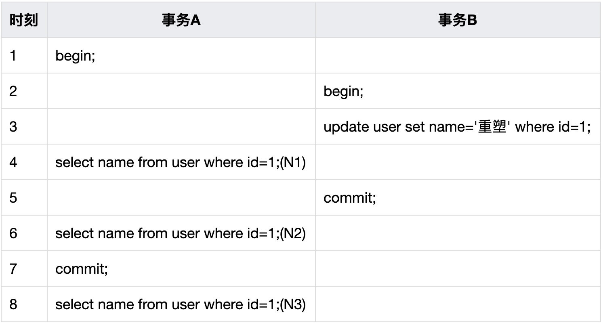
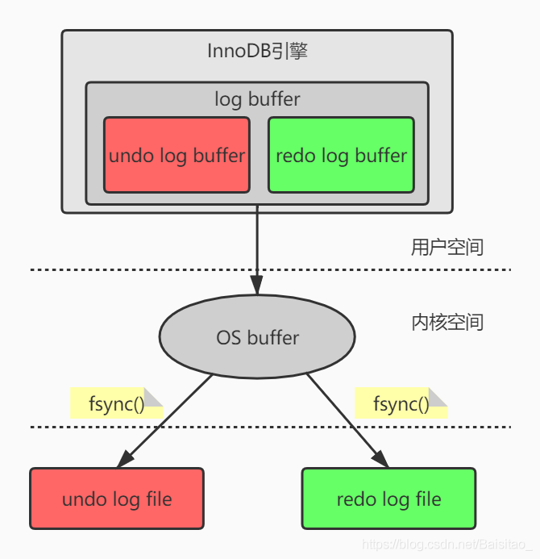
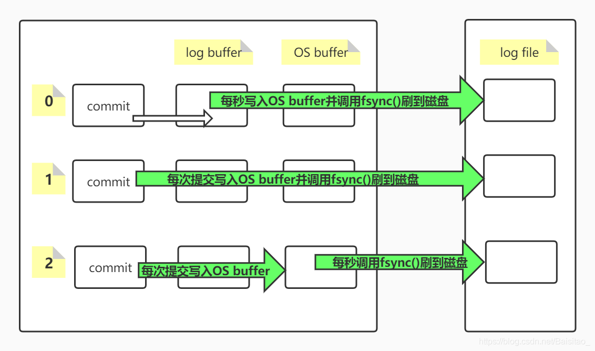

[toc]

[一文了解InnoDB事务实现原理 - 简书 (jianshu.com)](https://www.jianshu.com/p/9b83ea78b380)

[INNODB是如何实现事务的？_argleary的博客-CSDN博客_innodb如何实现事务](https://blog.csdn.net/argleary/article/details/104189850)

# 事务

事务不是指一次的读或者写，而是一系列的操作，必须要**完整的完成**的一系列操作，比如：转账

1. 查询我的账户余额
2. 我的账户扣款100元
3. 100元开始转移
4. 查询你的账户余额
5. 你的账户到账100元

有的DBA或许会认为undo是redo的逆过程，其实不然。redo和undo的作用都可以视为是一种恢复操作：

- redo恢复提交事务修改的页操作，
- 而undo回滚行记录到某个特定版本。

因此两者记录的内容不同，redo通常是物理日志，记录的是页的物理修改操作。undo 是逻辑日志，根据每行记录进行记录。

Redo用来保证事务的原子性和持久性，Undo能保证事务的一致性，两者也是系统恢复的基础前提。

# 原子性（atomicity)

一个事务要么全部提交成功，要么全部失败回滚，不能只执行其中的一部分操作，这就是事务的原子性。

## 使用undo log实现

将所有对数据的修改（增、删、改）都写入日志（undo log）。如果一个事务中的一部分操作已经成功，但另一部分操作，由于断电/系统崩溃/其它的软硬件错误而无法成功执行，则通过回溯日志，将已经执行成功的操作撤销，从而达到全部操作失败的目的。

undo log是逻辑日志，可以理解为：记录和事务操作相反的SQL语句，事务执行insert语句，undo log就记录delete语句。它以追加写的方式记录日志，不会覆盖之前的日志。除此之外undo log还用来实现数据库多版本并发控制（Multiversion Concurrency Control，简称MVCC）

# 一致性（consistency)

事务开始前和结束后，数据库的完整性约束没有被破坏。比如 A 向 B 转账，不可能 A 扣了钱，B 却没收到。（也就是说，事务开始前、事务结束后，AB两人的总钱数，是一样的）

通过事务来确保一致性。事实上，原子性、持久性和隔离性都是为了保证**一致性**。

# 隔离性（isolation）

四种隔离级别

1. 读未提交（Read Uncommited）读到未提交的数据
2. 读已提交（Read Commited）读到已提交的数据
3. 可重复读（Repeatable Read) 同一个事务内，多次读的结果是一致的
4. 串行化

[我所理解的MySQL之四：事务、隔离级别及MVCC-mysql教程-PHP中文网](https://www.php.cn/mysql-tutorials-462119.html)

举例： N1="刺猬"

## 读未提交(Read Uncommitted)——脏读

在读未提交的隔离级别下，事务中的修改，即便没有提交，对其他事务也都是可见的。

在上述场景中，若数据库的隔离级别为读未提交，由于事务A可以读取未提交事务B修改后的数据，即时刻3中事务B的修改对事务A可见，所以

1. N1=重塑，
2. N2=重塑， 
3. N3=重塑。

## 读已提交(Read Committed)——不可重复读

在读已提交的隔离级别下，事务中的修改只有在提交之后，才会对其他事务可见。

在上述场景中，若数据库的隔离级别为读已提交，由于事务A只能读取事务B提交后的数据，即时刻3中事务B的修改对事务A不可见，N2处的查询在事务B提交之后，故对事务A可见。所以

1. N1=刺猬，
2. N2=重塑，
3. N3=重塑。

==区别度已提交、可重复度==

## 可重复读

可重复读是MySQL的默认事务隔离级别。在可重复读的隔离级别下，一个事务中多次查询相同的记录，结果总是一致的。

在上述场景中，若数据库的隔离级别为可重复读，由于查询N1和N2在一个事务中，所以它们的值都是「刺猬」，而N3是在事 务A提交以后再进行的查询，对事务B的修改是可见的，所以N3=重塑。

1. N1=刺猬，
2. N2=刺猬，
3. N3=重塑

### 实现方式

1. 获取事务自己的版本号，即事务ID
2. 获取Read View
3. 查询得到的数据，然后Read View中的事务版本号进行比较。
4. 如果不符合Read View的可见性规则， 即就需要Undo log中历史快照;
5. 最后返回符合规则的数据

## 可串行化

在可串行化的隔离级别下，事务都是串行执行的，读会加读锁，写会加写锁，事务不会并发执行，所以也就不会发生异常情况。

在上述场景中，若数据库的隔离级别为可串行化，首先开启事务A，在开启事务B时被阻塞，直到事务A提交之后才会开启事务B，所以N1=刺猬，N2=刺猬。而N3处的查询会在事务B提交之后才执行(事 务B先被阻塞，执行顺序在N3查询语句之前)，所以N3=重塑。

### 实现方式

在MVCC的基础之上，通过间隙锁（Gap Lock）来解决的。

我们都知道InnoDB支持行锁，并且**行锁是锁住 PK索引**。而**间隙锁用来锁定索引记录间隙，确保索引记录的间隙不变**。

间隙锁是针对事务隔离级别为Repeatable Read或以上级别而已的，**间隙锁和行锁一起组成了Next-Key Lock**。**当InnoDB扫描索引记录的时候，会首先对索引记录加上行锁，再对索引记录两边的间隙加上间隙锁（Gap Lock）**。加上间隙锁之后，其他事务就不能在这个间隙插入记录。这样就有效的防止了幻读的发生。

默认情况下，InnoDB工作在Repeatable Read的隔离级别下，并且以Next-Key Lock的方式对索引行进行加锁。当查询的索引具有唯一性（主键、唯一索引）时，Innodb存储引擎会对Next-Key Lock进行优化，将其降为行锁，仅仅锁住索引本身，而不是范围（除非锁定不存在的值）。若是普通索引，则会使用Next-Key Lock将记录和间隙一起锁定。

## 可重复读和幻读

> “在可重复读中，该sql第一次读取到数据后，就将这些数据加锁（悲观锁），其它事务无法修改这些数据，就可以实现可重复读了”。但这种方法却无法锁住insert的数据，所以当事务A先前读取了数据，或者修改了全部数据，事务B还是可以insert数据提交，这时事务A就会发现莫名其妙多了一条之前没有的数据，这就是幻读，不能通过行锁来避免。需要Serializable隔离级别 ，读用读锁，写用写锁，读锁和写锁互斥，这么做可以有效的避免幻读、不可重复读、脏读等问题，但会极大的降低数据库的并发能力。

上面引号内的这段话不大对，对于可重复读，innodb使用的MVCC实现的。

但是MySQL、ORACLE、PostgreSQL等成熟的数据库，出于性能考虑，都是使用了以乐观锁为理论基础的MVCC（多版本并发控制）来实现。

## 脏读-不可重复读：

区别：

1. 事务 A中发生**两次读**，才会出现 **不可重复读**，N1 与 N2的结果不一样
2. 脏读，只读是否已提交的，在事务B提交前，N1='重塑'，这就是脏读

## 写写问题

上面的问题 脏读、幻读、不可重复读，都是读写的问题。

### 第一类丢失更新

第一类丢失更新是指：一个事务在撤销的时候，覆盖了另一个事务已提交的更新数据
假设事务A和事务B操作同一个账户的金：

|时间	|事务A	|事务B|
|-|-|-|
|T1|	开启事务|	开启事务|
|T2	|查询账户余额：500元|	查询账户余额：500元|
|T3	|取走100元，剩余400元|	取走100元，剩余400元|
|T4	|提交事务，账户余额：400元|	-|
|T5	|-	|撤销事务，账户余额：500元|

事务B在撤销事务的时候，覆盖了事务A在T4的时候已经提交的更新数据。A在T3的时候已经取走了100元，此时的余额应该是400元，但是由于事务B开始的时候，余额是500元，所以回滚后，余额也会变成500元。

### 第二类丢失更新

第二类丢失更新是指：一个事务在提交的时候，覆盖了另一个事务已提交的更新数据

|时间|	事务A	|事务B|
|-|-|-|
|T1|	开启事务|	开启事务|
|T2	|查询账户余额：500元	|查询账户余额：500元|
|T3	|取走100元，剩余400元	|取走100元，剩余400元|
|T4	|提交事务，账户余额：400元|	-|
|T5	|-	|提交事务，账户余额：400元|

事务A和事务B分别取了100元，所以余额应该为300元。但是事务B在提交的时候，覆盖了事务A已提交的更新数据，所以导致结果出错。

# 持久性（Duration）

事务一旦提交， 其结果就是永久性的。即使发生宕机等故障，数据库也能将数据恢复。

需要注意的是，只能从事务本身的角度来保证结果的永久性。例如，在事务提交后，所有的变化都是永久的。即使当数据库因为崩溃而需要恢复时，也能保证恢复后提交的数据都不会丢失。但若不是数据库本身发生故障，而是硬盘的损坏则不在考虑范围内

## 使用 redo、undo log实现

进行恢复时，根据 redo log重做所有事务包括未提交的事务和回滚了的事务。然后通过Undo Log回滚那些未提交的事务。

# 日志

[面试官：MySQL事务是怎么实现的_Sicimike的博客-CSDN博客_mysql的事务是怎么实现的](https://blog.csdn.net/Baisitao_/article/details/104723795)

`undo log`和`redo log`并不是直接写到磁盘上的，而是先写入`log buffer`。再等待合适的时机同步到`OS buffer`，再由操作系统决定何时刷到磁盘，具体过程如下：

既然undo log和redo log都是从log buffer 到 OS buffer，再到磁盘。所以中途还是有可能因为断电/硬件故障等原因导致日志丢失。为此MySQL提供了三种持久化方式，innodb_flush_log_at_trx_commit 这个参数主要控制InnoDB将log buffer中的数据写入OS buffer，并刷到磁盘的时间点，取值分别为0，1，2，默认是1。这三个值的意思分别如下

## redo log

## undo log

