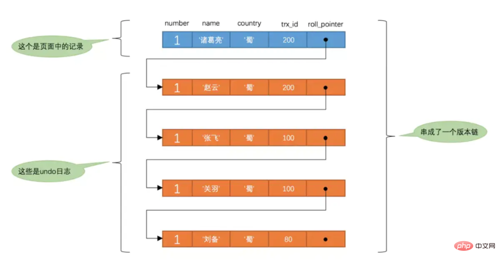

[toc]

[全网最全的一篇数据库MVCC详解，不全我负责-mysql教程-PHP中文网](https://www.php.cn/mysql-tutorials-460111.html)

[MVCC ReadView介绍 - IUNI_JM - 博客园 (cnblogs.com)](https://www.cnblogs.com/jmliao/p/13204946.html)

所谓的MVCC指的就是在使用READ COMMITTD、REPEATABLE READ这两种隔离级别的事务在执行普通的SEELCT操作时访问记录的**版本链**的过程，这样子可以使不同事务的读-写、写-读操作并发执行，从而提升系统性能。

# MVCC概念

全称Multi-Version Concurrency Control，即**多版本并发控制**，是“维持一个数据的多个版本，使**读写操作没有冲突**”的一个抽象概念，快照读是其具体实现。主要是为了提高数据库的并发性能。

- MVCC与悲观和乐观并发控制并不是对立的，很直观的一点MVCC可以在不加锁的情况下解决读-写冲突，并不能解决写-写冲突，写操作还是需要上锁
- MVCC可以与悲观并发或乐观并发结合使用来提高并发的性能

以下文章都是围绕InnoDB引擎来讲，因为myIsam不支持事务。

同一行数据平时发生读写请求时，会上锁阻塞住。但mvcc用**快照读**更好的方式去处理读—写请求，做到在**发生读—写请求冲突时不用加锁。**这个读是指的**快照读**（**快照读**就是读**数据行的以前版本**），而不是**当前读**，当前读是一种加锁操作，是悲观锁。

mvcc用来解决读—写冲突的无锁并发控制，就是为事务分配单向增长的时间戳。为每个数据修改保存一个版本，版本与事务时间戳相关联。

读操作只读取该事务开始前的数据库快照。

## MVCC了解决了：

- 并发读-写时：可以做到读操作不阻塞写操作，同时写操作也不会阻塞读操作。
- 解决脏读、幻读、不可重复读等事务隔离问题，但不能解决 写-写 更新丢失问题（现实中应该不存在 写-写问题，因为会上写锁）。

因此有了下面提高并发性能的组合拳：

- MVCC + 悲观锁（写锁）：MVCC解决读写冲突，悲观锁解决写写冲突

- MVCC + 乐观锁：MVCC解决读写冲突，乐观锁解决读写冲突

## 当前读

它读取的数据库记录，都是当前最新的版本，会对当前读取的数据进行加锁，防止其他事务修改数据。是悲观锁的一种操作。

如下操作都是当前读：

- select lock in share mode (共享锁)
- select for update (排他锁)
- update (排他锁)
- insert (排他锁)
- delete (排他锁)
- 串行化事务隔离级别

## 快照读

快照读的实现是基于多版本并发控制，即MVCC，既然是多版本，那么快照读读到的数据不一定是当前最新的数据，有可能是之前历史版本的数据。

如下操作是快照读：

- 不加锁的select操作（注：事务级别不是串行化）

MySQL对`insert`、`update`和`delete`语句所使用的**当前读**（current read）。因为涉及到数据的修改，所以MySQL必须拿到最新的数据才能修改，所以涉及到数据的修改肯定不能使用**快照读**（snapshot read）。

# MVCC的实现原理
它的实现原理主要是**版本链**，**undo日志** ，**Read View** 来实现的

## 版本链

我们数据库中的每行数据，除了我们肉眼看见的数据，还有几个隐藏字段，得开天眼才能看到。分别是db_trx_id、db_roll_pointer、db_row_id。

- db_trx_id：6byte，最近修改(修改/插入)事务ID：记录创建这条记录/最后一次修改该记录的事务ID。

- db_roll_pointer（版本链关键）：7byte，回滚指针，指向这条记录的上一个版本（存储于rollback segment里）

- db_row_id：6byte，隐含的自增ID（隐藏主键），如果数据表没有主键，InnoDB会自动以db_row_id产生一个聚簇索引。
- delete_flag：（就跟计组Cache中的标记位一样）实际还有一个删除flag隐藏字段, 记录被更新或删除并不代表真的删除，而是删除flag变了

如上图，db_row_id是数据库默认为该行记录生成的唯一隐式主键，db_trx_id是当前操作该记录的事务ID，而db_roll_pointer是一个回滚指针，用于配合undo日志，指向上一个旧版本。

每次对数据库记录进行改动，都会记录一条undo日志，每条undo日志也都有一个roll_pointer属性（INSERT操作对应的undo日志没有该属性，因为该记录并没有更早的版本），可以将这些undo日志都连起来，串成一个链表，所以现在的情况就像下图一样：

## undo日志

Undo log 主要用于记录数据被修改之前的日志，在表信息修改之前先会把数据拷贝到undo log里。

当事务进行回滚时可以通过undo log 里的日志进行数据还原。

# Read View 读(操作的)视图

事务进行**快照读**操作的时候生产的**读视图(Read View)**，在该事务执行的快照读的那一刻，会生成数据库系统当前的一个快照。

记录并维护**系统当前活跃事务的ID**(没有commit的事务ID。当每个事务开启时，都会被分配一个ID, 这个ID是递增的，所以越新的事务，ID值越大)列表 list，该list 是系统中当前不应该被本事务看到的其他事务id列表。

Read View主要是用来做可见性判断的：

1. 即当我们某个事务执行快照读的时候，对该记录创建一个Read View读视图，
2. 并将 trx_id（表中每个 roll中存储的 db_trx_id，即最后一次修改该 roll的事务id） 当做作条件，来判断当前事务能够看到哪个版本的数据，既可能是当前最新的数据，也有可能是该行记录的undo log里面的某个版本的数据。

## Read View几个属性

| 变量           | 描述                                                         |
| :------------- | :----------------------------------------------------------- |
| m_ids          | 当前系统中那些活跃(未提交)的读写事务ID, 它数据结构为一个List。 |
| max_limit_id   | 表示生成Read View时，系统中应该分配给下一个事务的id值。      |
| min_limit_id   | 表示在生成Read View时，当前系统中活跃的读写事务中最小的事务id，即m_ids中的最小值。 |
| creator_trx_id | 创建当前Read View的事务ID                                    |

判断是否可以直接读，如果不能`直接读`，则需要去 undo log中`快照读`

- `trx_id` == `creator_trx_id`，则**可以访问**：如果被访问版本的`trx_id`属性值与`ReadView`中的`creator_trx_id`值相同，意味着当前事务在访问它自己修改过的记录，所以该版本可以被当前事务访问。
- `trx_id`  <`min_trx_id`，则**可以访问**：如果被访问版本的`trx_id`属性值小于`ReadView`中的`min_trx_id`值，表明生成该版本的事务在当前事务生成`ReadView`前已经提交，所以该版本可以被当前事务访问。
- `max_trx_id` <= `trx_id` ，则**不可以访问**： 如果被访问版本的`trx_id`属性值大于或等于`ReadView`中的`max_trx_id`值，表明生成该版本的事务在当前事务生成`ReadView`后才开启，所以该版本不可以被当前事务访问。
- `min_trx_id`<= `trx_id` < `max_trx_id`，则需分析`trx_id∈m_ids` 和 `trx_id∉m_ids`： 如果被访问版本的`trx_id`属性值在`ReadView`的`min_trx_id`和`max_trx_id`之间，那就需要判断一下`trx_id`属性值是不是在`m_ids`列表中，如果在，说明创建`ReadView`时生成该版本的事务还是活跃的，该版本**不可以访问**；如果不在，说明创建`ReadView`时生成该版本的事务已经被提交，该版本**可以访问**。

注：以上 trx_id是当前被访问的行的 db_trx_id

# 根据 Read View实现隔离级别

## 读已提交 和 可重复度

上面所讲的Read View用于支持RC（Read Committed，读提交）和RR（Repeatable Read，可重复读）隔离级别的实现。RR、RC生成时机

- RC隔离级别下，是每个快照读都会生成并获取最新的Read View；
- 而在RR隔离级别下，则是**同一个事务中的第一个快照读**才会创建Read View, 之后的快照读获取的都是同一个Read View，之后的查询就不会重复生成了，所以一个事务的查询结果每次都是一样的。

## 可重复读

1. 获取事务自己的版本号，即事务ID
2. 获取Read View
3. 查询得到的数据，然后Read View中的事务版本号进行比较。
4. 如果不符合Read View的可见性规则， 即就需要Undo log中历史快照;
5. 最后返回符合规则的数据

### 举例

在可重复读（RR）隔离级别下，一个事务里只会获取一次`read view`，都是副本共用的，从而保证每次查询的数据都是一样的。

假设当前有一张core_user表，插入一条初始化数据,如下：

基于MVCC，我们来看看执行流程

1. A开启事务，首先得到一个事务ID为100
2. B开启事务，得到事务ID为101
3. 事务A生成一个Read View，read view对应的值如下

| 变量           | 值       |
| :------------- | :------- |
| m_ids          | 100，101 |
| max_limit_id   | 102      |
| min_limit_id   | 100      |
| creator_trx_id | 100      |

然后回到版本链：开始从版本链中挑选可见的记录：

由图可以看出，最新版本的列name的内容是孙权，该版本的trx_id值为100。开始执行**read view可见性规则**校验：

> min_limit_id(100) <= trx_id（100）<102;
> creator_trx_id = trx_id =100;

由此可得，trx_id=100的这个记录，当前事务是可见的。所以查到是**name为孙权**的记录。

4. 事务B进行修改操作，把名字改为曹操。把原数据拷贝到undo log,然后对数据进行修改，标记事务ID和上一个数据版本在undo log的地址。

5. 事务B提交事务
6. 事务A再次执行查询操作，因为是RR（可重复读）隔离级别，因此会复用老的Read View副本，Read View对应的值如下

| 变量           | 值       |
| :------------- | :------- |
| m_ids          | 100，101 |
| max_limit_id   | 102      |
| min_limit_id   | 100      |
| creator_trx_id | 100      |

